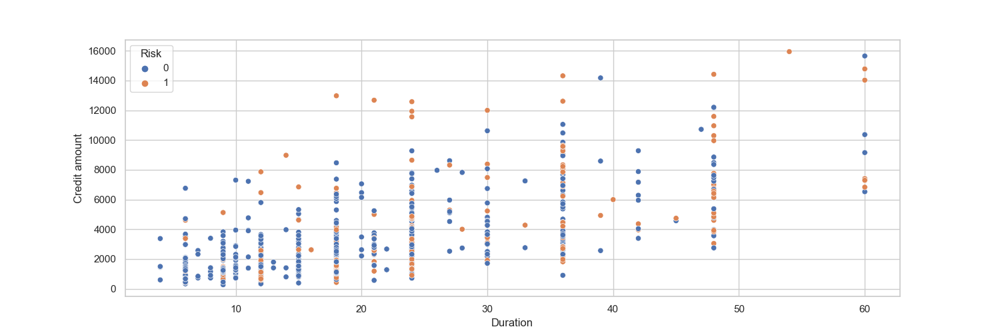

# German Bank Credit Risk Prediction

# 1. Description
- This is an end to end machine learning project using Random Forest to predict credit risk of German Bank's customers. It involves supervised learning (using a labeled training set) for classification, where the target is 1 if the customer represents a bad risk and 0 if he represents a good risk.
- I implemented this project following some CI/CD principles and using modular coding. First, I developed my entire analysis (from EDA to modeling) in notebooks. Then, I divided the project development into components responsible for data ingestion, transformation, and model training, following the same steps as in the notebooks. Once I had done this, I created scripts for automating the training and prediction pipelines using these components. The training pipeline executes them and obtains all the machine learning model artifacts, while the prediction pipeline makes predictions by consuming the obtained artifacts. All of this was made with good practices like virtual environment use (isolating dependencies), exception handling, loggings, documentation, etc. Afterward, I built a web app in Flask, integrating everything mentioned above. My objective with this was to get closer to a real data science project workflow by packaging my entire project as a package.
- The technologies used were Python (Pandas, Numpy, Matplotlib, Seaborn, Scikit-Learn, Category-Encoders, Scikit-Optimize, Xgboost), Git and Github (version control), Anaconda (terminal) and Visual Studio Code (project development environment).

# 2. Business problem and project objective
Predict credit risk of German Bank's customers.

Credit risk refers to the potential financial loss that a lender, such as a bank, might incur if a borrower fails to repay a loan or credit obligation. It's the uncertainty about whether borrowers will honor their financial commitments.

The German Bank aims to predict their customers' credit risk for several reasons:

1. Risk assessment.
2. Profitability.
3. Minimize losses.
4. Compliance.
5. Customer segmentation.
6. Strengthen trust.

By employing predictive models, the bank can make informed decisions that balance profit generation with prudent risk management, ultimately benefiting both the institution and its customers. Thus, the project objective is to build a model that is able to identify as many as possible bad risk customers and provide valuable insights about credit risk within the available features. By doing this, the business problem is solved.

# 3. Solution pipeline
The following pipeline was used, based on CRISP-DM framework:

1. Define the business problem.
2. Collect the data and get a general overview of it.
3. Split the data into train and test sets.
4. Explore the data (exploratory data analysis)
5. Data cleaning and preprocessing.
6. Model training, comparison, selection and tuning.
7. Final production model testing and evaluation.
8. Conclude and interpret the model results.
9. Deploy.

# 4. Main business insights
1. Young customers tend to present higher credit risk. This makes sense since younger people usually don't have financial stability.
2. Customers who take higher credit amounts from the bank tend to present higher risk. This makes total sense. The higher the credit amount taken, the harder it is to pay it.
3. Customers whose credit services have a long duration present higher risk. The more time a customer spends using a credit service without paying it, the higher the risk of default.

4. Credit amount and Duration are strongly positively correlated. Credit services with longer durations generally are associated with higher credit amounts and vice-versa.

5. Customers with little saving and checking accounts tend to present higher credit risk. Particularly, almost 50% of the customers who have little checking accounts are bad risk ones. Moreover, when a customer takes credit from the bank for vacation/others and education purposes, it must be alert. Specifically, almost 50% of the customers who took credit for education are bad risk.

6. On average, customers who have highly skilled jobs, free housing, and vacation/other purposes tend to borrow larger credit amounts from the bank and, consequently, for longer durations, presenting higher levels of risk.

# 5. Modelling
1. I chose a set of models for performance comparison, analyzing the ROC-AUC score. Accuracy is not a good metric because the target is imbalanced.
2. In order to select the best model for hyperparameter tuning and final evaluation, I trained and evaluated each of the models using stratified k-fold cross-validation, which provides a more reliable performance estimate.
3. Although Logistic Regression had the best average validation score, I chose Random Forest for the next steps because there was more room for performance improvement with it. It was overfitting, and I could apply some regularization techniques to enhance its generalization ability.

4. I tuned Random Forest model with Bayesian Search because it uses probabilistic models to intelligently explore the hyperparameter space, balancing exploration and exploitation. An important point here was to define a class_weight hyperparameter, such that the estimator was able to better learn the patterns in minority target class (bad risk customers).
5. I evaluated the results and looked at precision-recall trade-off. Once the project aim is to predict as many as possible bad risk customers, recall is the metric of interest. Thus, I selected a threshold that provided a 0.8 recall without significantly compromising the precision score, getting a final model with satisfying results! The predictions were made by comparing the model's estimated probabilities of being bad risk with this threshold. If the probability is greater than the threshold the instance is classified as positive, else negative. In fact, the precision fell down just 0.01 (from 0.49 to 0.48) while the sensitivity increased at 0.12 (from 0.68 to 0.8).

Classification report before precision-recall trade-off balancing:

Classification report after precision-recall trade-off balancing:

6. Although one characteristic of ensemble models like Random Forest is the lack of interpretability, it was possible to interpret and confirm that the estimator results make sense and reinforce the insights found in the EDA (Exploratory Data Analysis) step by examining feature importances. The following features clearly demonstrated discrimination between good and bad risk customers.

Finally, the results are satisfying, and the project objective was achieved. The model can predict 80% of the bad risk customers, effectively solving the business problem. In summary, to address the imbalanced target, I implemented strategies such as stratified hold-out and k-fold cross-validation, utilized class-weight hyperparameter, and balanced precision-recall trade-off.

# 6. Web app and next steps
Once I built a model that solves the business problem by identifying 80% of the bad risk customers, I developed a Flask web app such that we can get predictions for any customer by giving the input features information. For the next steps, I will be focused on deploying this app in a cloud like AWS (I already defined a file containing Elastic Beanstalk configuration, .ebextensions/config.py). Anyway, I describe in the next topic how you can run this project on your local machine.

Web app home page:

Web app predictions page:

# 7. Run this project on your local machine
Prerequisites:

Before getting started, make sure you have the following installed on your machine:
- Python
- pip (Python package manager)
- Git (Version control tool)

Steps:

1. Clone the repository:
<pre>
git clone https://github.com/allmeidaapedro/Credit-Risk-Prediction-German-Bank.git
cd Credit-Risk-Prediction-German-Bank
</pre>

2. Activate the Virtual Environment:

Activate the virtual environment used to isolate the project dependencies.
<pre>
source venv/bin/activate  # On Windows, use 'venv\Scripts\activate'
</pre>

3. Install Dependencies:

Use pip to install the required dependencies listed in the requirements.txt file.
<pre>
pip install -r requirements.txt
</pre>

4. Run the Application:
<pre>
python application.py
</pre>

5. Access the Project Locally:

After running successfully, you can access the project locally. Open a web browser and navigate to http://127.0.0.1:5000/

Then, go to the prediction page, select the input features values and click on submit. The prediction result will appear on the right side.

6. Shutdown the Application:

To stop the application, you can typically press Ctrl+C in the terminal where the application is running.

7. Deactivate the Virtual Environment:

When you're done with the project, deactivate the virtual environment.

<pre>
deactivate
</pre>

# 8. Dataset link
The dataset was collected from kaggle and it belongs to UCI machine learning repository.

Link: https://www.kaggle.com/datasets/kabure/german-credit-data-with-risk